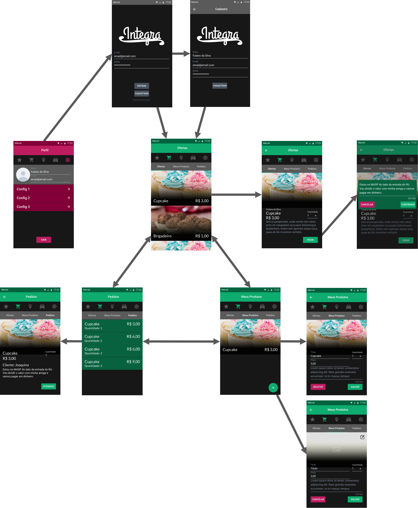
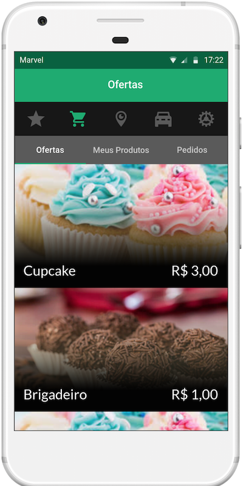

A partir dos fluxos de telas definidos pelo [protótipo de baixa fidelidade](/2018.2-iFood/docs/baixa-fidelidade) e dos padrões definido pelo [guia de identidade visual](/2018.2-iFood/docs/id-visual), foi produzido um protótipo de alta fidelidade com o design seguindo os padrões de aplicativos do Android na ferramenta de produção de protótipos do [Marvel](https://marvelapp.com/). O protótipo da alta fidelidade teve como objetivo concretizar os padrões visuais do aplicativo e testar a usabilidade com os *stakeholders*.

A seção [Fluxo de telas](#fluxo-de-telas) apresenta as telas desenvolvidas a demonstrando o fluxo principal do aplicativo no serviço de vendas e na aba de configurações. O acesso ao protótipo de alta fidelidade está na seção [Protótipo no Marvel](#prototipo-no-marvel).

## Fluxo de telas

## Protótipo no Marvel
Clique na imagem abaixo para acessar o protótipo.

