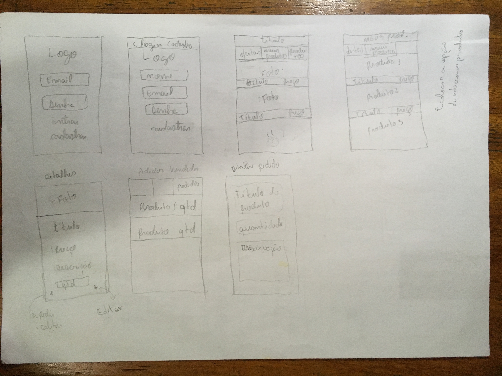
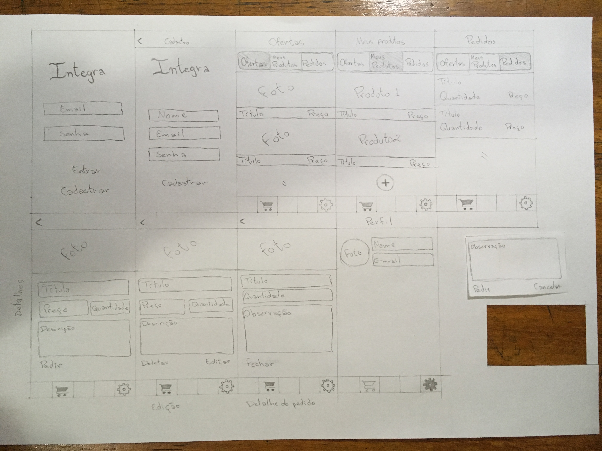

O protótipo de baixa fidelidade foi produzido para projetar os fluxo de telas e a distribuição das funcionalidades no aplicativo. Além disso, a partir do protótipo de baixa fidelidade foi discutido como seriam as relações das funcionalidades das outras equipes e como elas poderiam interferir com as funcionalidades de vendas produzidas pela nossa equipe.

Desenhado no papel para ter maior facilidade de modificação, como ilustrado nas imagens da [versão 1](#vers%C3%A3o-1) e da [versão 2](#vers%C3%A3o-2), o protótipo foi simulado a partir da ferramenta [Marvel](https://marvelapp.com/) e foi disponibilizado para análize no link https://marvelapp.com/3e1607a .

## Versão 1

## Versão 2

