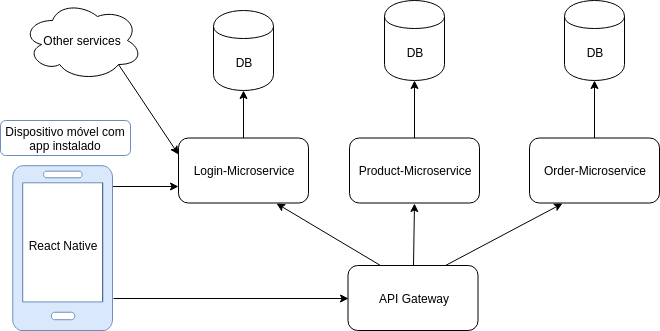
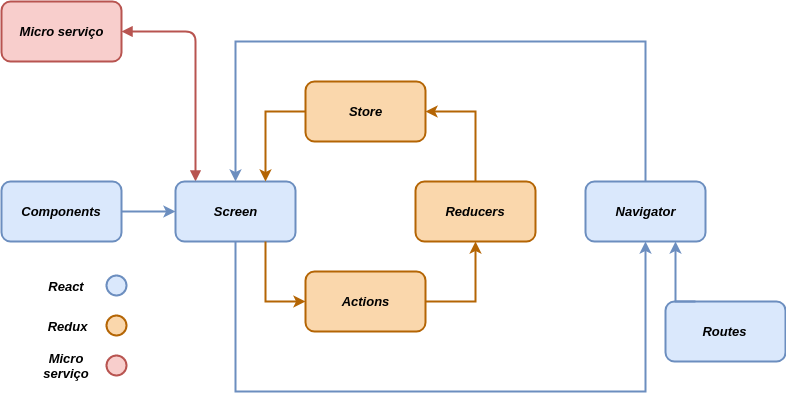
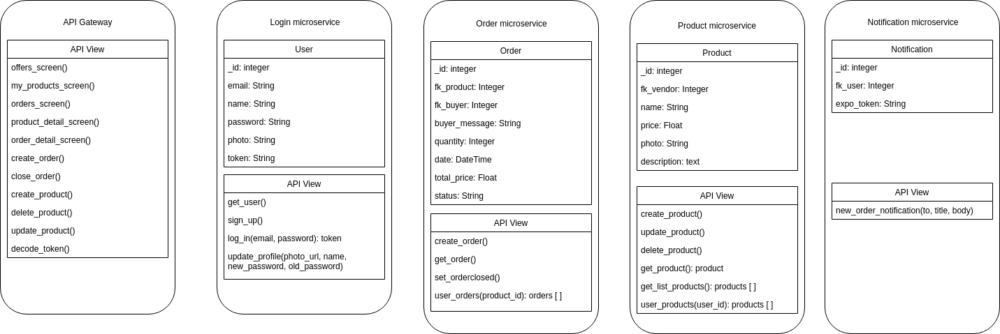
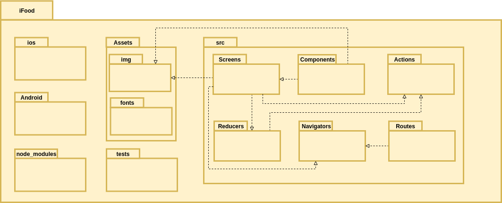
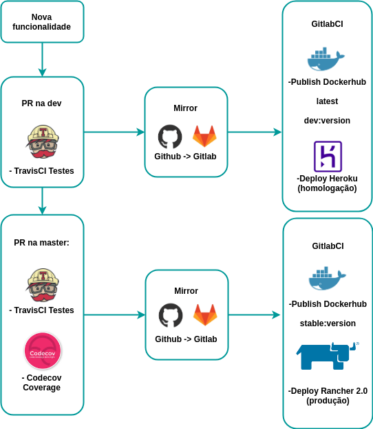

# 1 Introdução

## 1.1 Finalidade

O documento de arquitetura tem o objetivo de especificar decisões arquiteturais relevantes ao projeto iFood, descrevendo seus aspectos e funcionalidades do sistema de forma clara e objetiva, onde serão utilizadas as tecnologia Django REST Framework e React Native.

## 1.2 Escopo

Este documento se aplica à produção do aplicativo iFood, implementado para as plataformas IOS e Android, representando a arquitetura utilizada.

# 2 Representação da Arquitetura

## 2.1 Diagrama de relações

O diagrama apresenta cada etapa que será seguido para que o aplicativo funcione, relacionando o front-end com o back-end.

## 2.2 Diagrama React/Redux/Microsserviços

### React-Native

O React-Native é um framework que utiliza o mesmo design que o React tendo aplicação na construção de aplicativos mobile utilizando apenas javascript e traz uma rica interface, a partir de componentes declarativos, para o ambiente mobile. O React-Native trás uma propósta rápida e prática para recarregar o aplicativo instantâneamente, sem precisar compilar, com o "Hot Recoading", que tem como objetivo trazer um feedback em menos de 1 segundo. Este framework combina os componentes escritos em Objective-C, Java, ou Swift, podendo ser escritas parte do aplicativo usando um código nativo.

### Redux

O Redux é um container de estado previsível para aplicativos JavaScript. Esse container ajuda a manter a consistência dos aplicativos em ambientes diferentes, sendo fácil de testar e proporcionando uma boa experiência ao desenvolvedor.

### Micro Serviços

Um micro serviço é um componente de alta coesão, baixo acoplamento, autônomo e independente, que representa um contexto de negócio de uma aplicação. Ou seja, um micro serviço é totalmente independente e muito importante no desenvolvimento de um software, que geralmente é feito com vários micro serviços, implicando assim em um software mais simples e bem particionado, o que facilita sua manutenção.

## 2.2 Diagrama Django REST Framework

### Model

A model é a representação dos, permitindo obter informações do banco de dados sem conhecer a complexidade de tal. Essa camada contém tudo sobre os dados: como acessar, validar, comprotamentos e relações entre dados.

### View

A view controla o fluxo de informações entre a model e o template. Essa camada utiliza lógica programada para decidir quais informações serão extraídas do banco de dados e quais serão transmitidas para exibição.

### Serializer

Os serializers permitem que dados complexos sejam convertidos em tipos de dados nativos do phyton, que podem ser renderizados facilmente em JSON, XML e outros tipos de conteúdo.No Django rest os serializers funcionam de forma semelhante às classes Form e ModelForm do Django. Fornecemos uma classe Serializer que fornece uma maneira poderosa de controlar a saída de suas respostas, bem como uma classe ModelSerializer que fornece um atalho útil para a criação de serializers que lidam com instâncias da model.

### URL

O framework REST tem suporte para o roteamento automático de URL para o Django, e fornece a você uma forma simples, rápida e consistente de conectar sua lógica de visualização a um conjunto de URLs. Tem funcionalidade similar a outras estruturas web como Rails.

### Test

O framework REST inclui algumas classes auxiliares que herdam a estrutura de teste existente do Django e melhoram o suporte para fazer API requests.

# 3 Metas e Restrições de Arquitetura

Para o desenvolvimento deste projeto serão ultilizadas as seguintes tecnologias:

- React-native: Utilizado para a construção do aplicativo em IOS e Android;
- Redux: Utilizado para armazenar e resgatar dados dentro da aplicação React;
- Python: Versão 3.6 como linguagem base das aplicações back-end
- Django: Framework para desenvolvimento de aplicações web em python
- Django REST Framework: Utilizado para construção de API's e micro serviços;
- RabbitMQ: Barramento de mensagens entre os micro serviços e o aplicativo;
- PostgreSQL: Banco de Dados relacional;
- Cloudnary: Serviço de armazenamento de imagens
- Expo push notifications: Serviço para implantar notificações no app

# 4 Visão de Implementação

## 4.1 Diagrama de classes e serviços

## 4.2 Diagrama de Pacotes

### Front-end

### Back-end

# 5 Pipeline de deploy dos microsserviços

