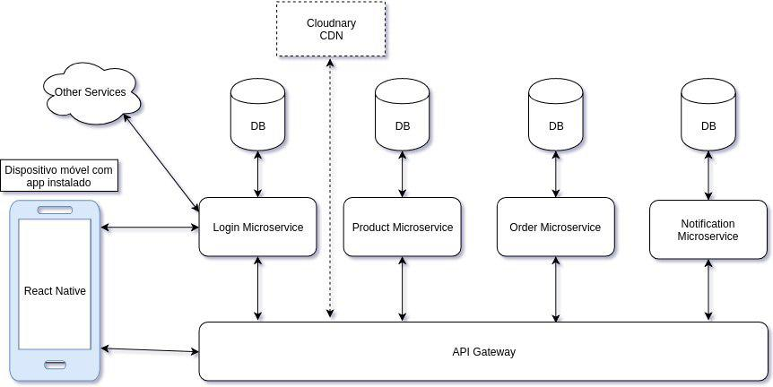

# 1 Introdução

## 1.1 Finalidade

O documento de arquitetura tem o objetivo de especificar decisões arquiteturais relevantes ao projeto Integra, descrevendo seus aspectos e funcionalidades do sistema de forma clara e objetiva, onde serão utilizadas as tecnologias Django REST Framework e React Native.

## 1.2 Escopo

Este documento se aplica à produção do aplicativo Integra, implementado para a plataforma *Android*, representando a arquitetura utilizada.

# 2 Representação da Arquitetura

## 2.1 Diagrama de relações

O diagrama apresenta cada etapa que será seguida para que o aplicativo funcione, relacionando o *front-end* com o *back-end*.

## 2.2 Diagrama React/Microsserviços

### React-Native

O React-Native é um *framework* que utiliza o mesmo *design* que o React tendo aplicação na construção de aplicativos *mobile* utilizando apenas *javascript* e traz uma rica interface, a partir de componentes declarativos, para o ambiente *mobile*. O React-Native trás uma propósta rápida e prática para recarregar o aplicativo instantâneamente, sem precisar compilar, com o *"Hot Recoading"*, que tem como objetivo trazer um *feedback* em menos de 1 segundo. Este *framework* combina os componentes escritos em Objective-C, Java, ou Swift, podendo ser escritas parte do aplicativo usando um código nativo [1].

### Microsserviços

Um microsserviço é um componente de alta coesão, baixo acoplamento, autônomo e independente, que representa um contexto de negócio de uma aplicação [2].
Ou seja, um microsserviço é totalmente independente e muito importante no desenvolvimento de um *software*, que geralmente é feito com vários microsserviços, implicando assim em um *software* bem particionado, o que pode vir a facilitar sua manutenção.

## 2.2 Diagrama Django REST Framework

### *Model*

A *model* é a representação dos objetos, permitindo obter informações do banco de dados sem conhecer a complexidade de tal. Essa camada contém tudo sobre os dados: como acessar, validar, comportamentos e relações entre dados [3].

### *View*

A *view* controla o fluxo de informações entre a *model* e o *template*. Essa camada utiliza lógica programada para decidir quais informações serão extraídas do banco de dados e quais serão transmitidas para exibição [4].

### *Serializer*

Os *serializers* permitem que dados complexos sejam convertidos em tipos de dados nativos do python, que podem ser renderizados facilmente em JSON, XML e outros tipos de conteúdo. No Django Rest, os *serializers* funcionam de forma semelhante às classes *Form* e *ModelForm* do Django. A classe *Serializer* fornece uma maneira de controlar a saída de suas respostas, bem como uma classe *ModelSerializer* que fornece um atalho útil para a criação de *serializers* que lidam com instâncias da *model* [5].

### *URL*

O *framework* REST tem suporte para o roteamento automático de URL para o Django, e fornece uma forma simples, rápida e consistente de conectar sua lógica de visualização a um conjunto de URLs. Tem funcionalidade similar a outras estruturas *web* como Rails [6].

### *Test*

O *framework* REST inclui algumas classes auxiliares que herdam a estrutura de teste existente do Django e melhoram o suporte para fazer requisições para a API [7].

# 3 Metas e Restrições de Arquitetura

Para o desenvolvimento deste projeto serão ultilizadas as seguintes tecnologias:

- React-native: Utilizado para a construção do aplicativo em *Android*;
- Python: Versão 3.6 como linguagem base das aplicações *back-end*
- Django: *Framework* para desenvolvimento de aplicações *web* em python
- Django REST Framework: Utilizado para construção de API's e microsserviços;
- RabbitMQ: Barramento de mensagens entre os microsserviços e o aplicativo;
- PostgreSQL: Banco de Dados relacional;

# 4 Visão de Implementação

## 4.1 Diagrama de classes e serviços

## 4.2 Diagrama de Pacotes

### *Front-end*

### *Back-end*

# 5 *Pipeline* de *deploy* dos microsserviços

# 6 Referências bibliográficas

[1] Codificar. O que é React Native? O futuro do desenvolvimento híbrido. Disponível em: <https://codificar.com.br/aplicativos/o-que-e-react-native-o-futuro-desenvolvimento-hibrido/>. Acesso em: 25/11/18.

[2] DevMedia. Microserviços em Java. Disponível em: <https://www.devmedia.com.br/forum/microservicos-em-java/580548>. Acesso em: 25/11/2018.

[3] Django Girls Tutorial. Modelos do Django. Disponível em: <https://tutorial.djangogirls.org/pt/django_models/>. Acesso em: 25/11/18.

[4] Django Rest Framework. Class-based Views. Disponível em: <https://www.django-rest-framework.org/api-guide/views/>. Acesso em: 25/11/18.

[5] Django Rest Framework. Serializers. Disponível em: <https://www.django-rest-framework.org/api-guide/serializers/>. Acesso em: 25/11/18.

[6] Django Girls Tutorial. URL's. Disponível em: <https://tutorial.djangogirls.org/pt/django_urls/>. Acesso em: 25/11/18.

[7] Django Rest Framework. Testing. Disponível em: <https://www.django-rest-framework.org/api-guide/testing/>. Acesso em: 25/11/18.
