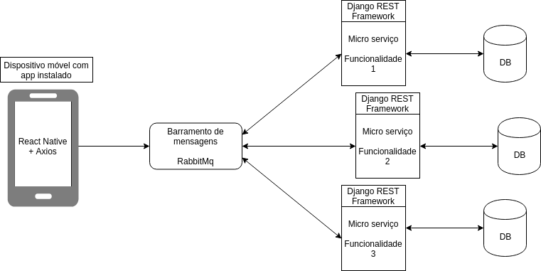

# 1 Introdução

## 1.1 Finalidade

O documento de arquitetura tem o objetivo de especificar decisões arquiteturais relevantes ao projeto iFood, descrevendo seus aspectos e funcionalidades do sistema de forma clara e objetiva, onde serão utilizadas as tecnologia Django REST Framework e React Native.

## 1.2 Escopo

Este documento se aplica à produção do aplicativo iFood, implementado para as plataformas IOS e Android, representando a arquitetura utilizada.

# 2 Representação da Arquitetura

## 2.1 Diagrama de relações

O diagrama apresenta cada etapa que será seguido para que o aplicativo funcione, relacionando o front-end com o back-end.

## 2.2 Diagrama React/Redux/Microsserviços

### React-Native

### Redux

### Micro Serviços

## 2.2 Diagrama Django REST Framework

### Model

### View

### Serializer

### URL

### Test

# 3 Metas e Restrições de Arquitetura

Para o desenvolvimento deste projeto serão ultilizadas as seguintes tecnologias:

- React-native: Utilizado para a construção do aplicativo em IOS e Android;
- Redux: Utilizado para armazenar e resgatar dados dentro da aplicação React;
- Python: Versão 3.6 como linguagem base das aplicações back-end
- Django: Framework para desenvolvimento de aplicações web em python
- Django REST Framework: Utilizado para construção de API's e micro serviços;
- RabbitMQ: Barramento de mensagens entre os micro serviços e o aplicativo;
- PostgreSQL: Banco de Dados relacional;

# 4 Visão de Implementação

## 4.1 Modelagem de dados

imagem

## 4.2 Diagrama de Pacotes

### Front-end

### Back-end

# 5 Pipeline

## APP

imagem

## Micro serviços

imagem
