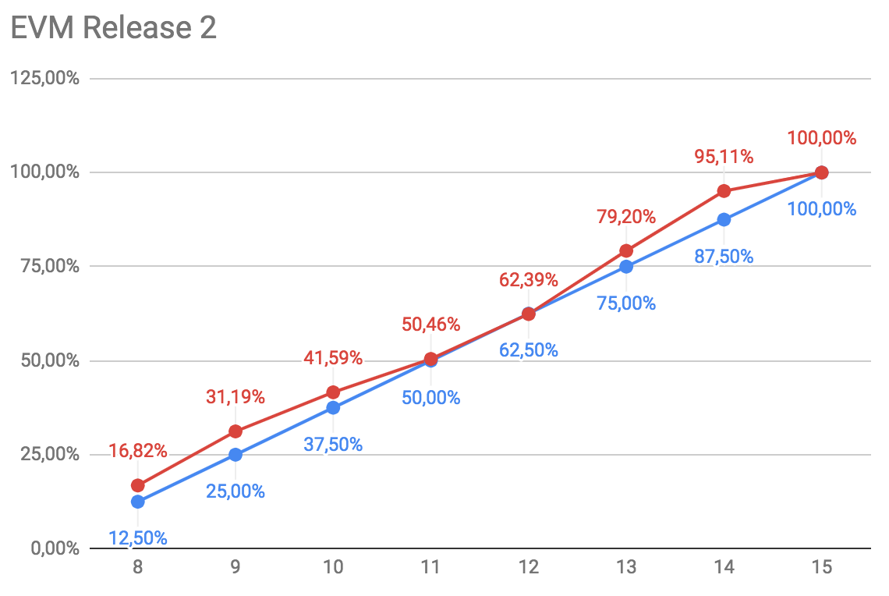

O EVM é um documento utilizado em projetos para comunicar o acompanhamento do retorno de investimento quanto ao que está sendo executado dentro do projeto e está descrito é descrito no PMBOK.

## EVM Agile

Para que seja possível acompanhar a saúde de um projeto ágil, o EVM precisa de algumas adaptações, já que não é um projeto cascata, tendo particularidades como um projeto de escopo, podendo ser alterado ao longo do tempo e contendo métricas particulares à metodologia como histórias de usuário, pontos de histórias de usuário, etc. [1](#referencias)

## Legenda

|Métrica|Descrição|
|-------|---------|
|PC|Pontos Reais completados|
|PA|Novas funcionalidades adicionadas ao projeto|
|SC|Custo de cada sprint|
|PRP|Soma de todos os pontos da release|
|RPC|Pontos completados por sprint na release|
|APC|Porcentagem real de histórias completadas em cada sprint|
|PPC|Porcentagem planejada das sprints ao longo da release|
|BAC|Orçamento para release|
|AC|Modo análogo ao PV|
|PV|PPC * BAC|
|EV|Valor agregado calculado como PPC * BAC / PRP|
|CV|TEV - AC|
|SV|TEV - PV|
|CPI|TEV / AC|
|SPI|TEV / PV|

## Planilha EVM

A planilha com todos os dados do EVM, tanto da release 1 e da release 2 está disponível em [EVM](https://docs.google.com/spreadsheets/d/1-9_IZAkohG6TObwngSHjI-Ua9gkoXecHn9dI-WMfIe8/edit?usp=sharing).

## Release 1

|Métrica|Descrição|Valor|
|-------|---------|-----|
|BAC|Orçamento Disponível Release 1|R$ 165.312,50|
|L|Tamanho da Sprint em dias|7|
|PS|Total de Sprints Planejadas|5|
|SD|Data de inínio|25/08/2018|
|PRP|Pontos Planejados para Release 1|223|

## Release 2

|Métrica|Descrição|Valor|
|-------|---------|-----|
|BAC|Orçamento Disponível Release 1|R$ 231.467,50|
|L|Tamanho da Sprint em dias|7|
|PS|Total de Sprints Planejadas|7|
|SD|Data de inínio|06/10/2018|
|PRP|Pontos Planejados para Release 2|319|

## Referências
[1](https://github.com/fga-eps-mds/A-Disciplina/blob/master/Agil_material/AgileEVM_-_Earned_Value_Management_in_Scrum_Projects.pdf) Sulaiman T., Barton B., Blackburn T. AgileEVM – Earned Value Management in Scrum Projects.

EVM Dr. Down. Acesso em: https://fga-eps-mds.github.io/2018.1-Dr-Down/eps/EVM_AGILE/ 
