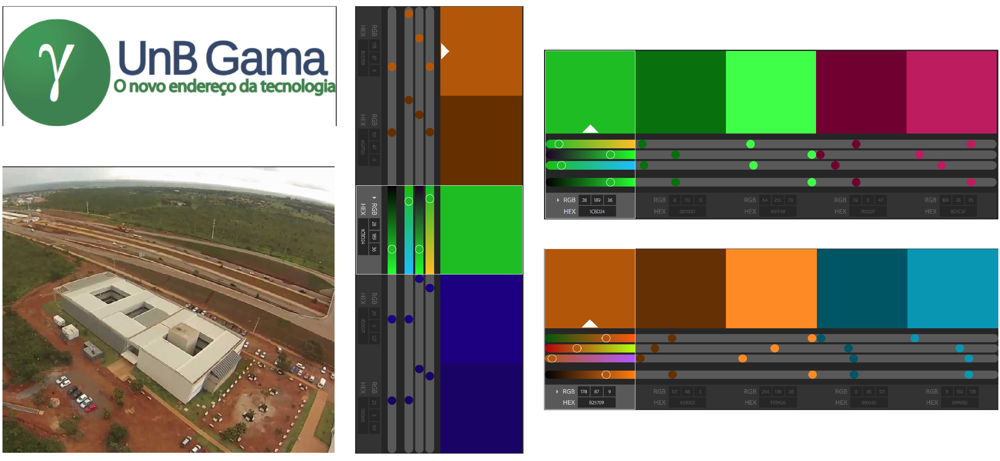
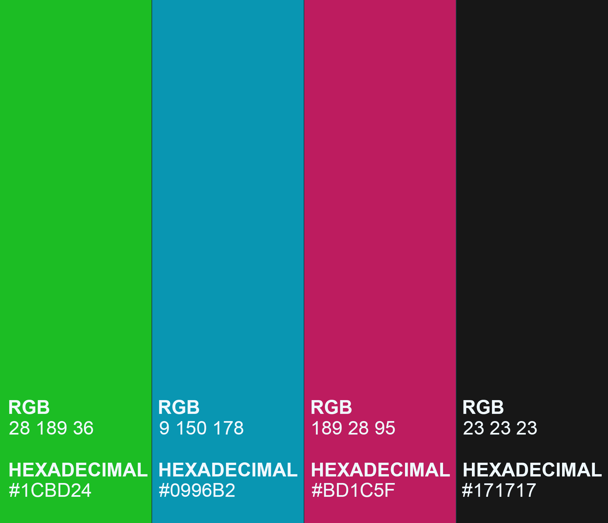
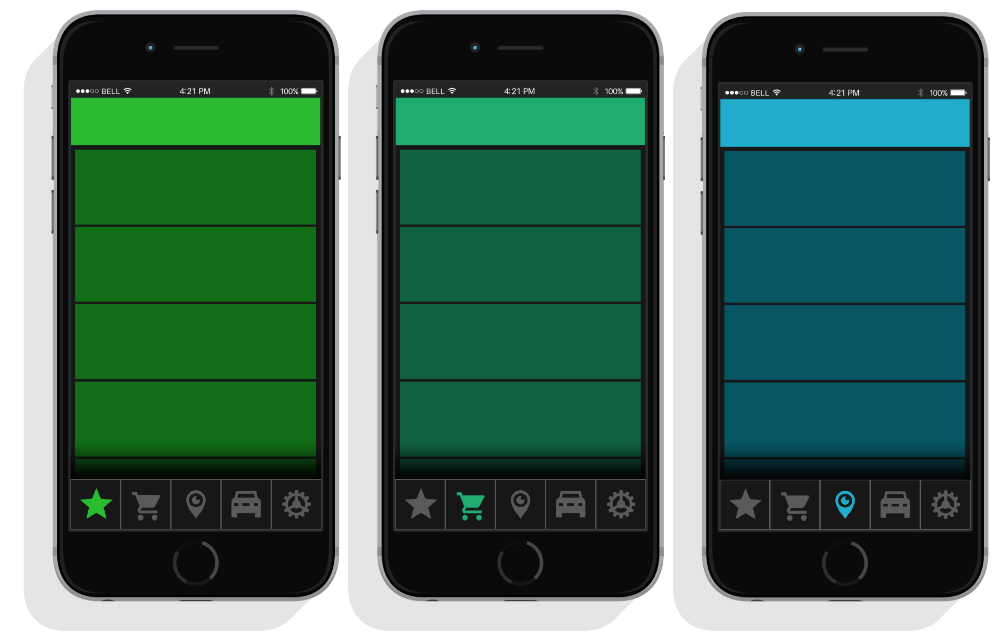

# 1 Introdução
O Guia de identidade visual apresenta convenções para o *design* das telas da aplicação e para sua identidade visual a partir da definição de logomarca do produto, paleta de cores, tipografia e *framework* utilizada na produção do *front-end*. Essas definições têm como objetivo ajudar a uniformizar a experiência do usuário durante o uso da aplicação.

# 2 Paleta de cores
As cores foram definidas a partir da análise da logo da FGA e de fotos aéreas do campus. As cores coletadas foram comparadas junto as suas cores complementares para a criação da paleta primária de cores do aplicativo.

A partir das cores escolhidas foi feito um gradiente entre elas para entender como elas transacionam e a partir da transição foram identificadas as cinco cores que são usadas para definir a identidade de cada funcionalidade. Os ícones de cada funcionalidade são do estilo Material e foram extraídos do banco de ícones Icons8 [[1]](#5-referencias).

Cada ícone ilustrado na imagem acima representa uma funcionalidade diferente do aplicativo, sendo eles respectivamente:
* Verde Lima - Eventos
* Verde Jade - Vendas
* Azul Turquesa - Indicação de locais
* Roxo - Proteção do carro
* Carmesim - Configurações

## 2.1 Paleta
Para verificar a conformidade da paleta de cores foi utilizado como base as cores derivadas das cores bases pelo Adobe Color [[2]](#5-referencias). Algumas cores tiveram os valores alterados comparado a paleta de cor inicial para aumentar a saturação.

## 2.2 Identidade das funcionalidades pelas cores
Cada funcionalidade será identificada por uma cor para melhorar a experiência de usuário. Ao selecionar um ícone na *Tab Bar* esse se acenderá com sua cor de identificação e o usuário terá acesso às telas da funcionalidade escolhida, que também estarão caracterizadas com as suas cores de identidade como mostra o exemplo abaixo.

### Exemplo v1

### Exemplo v2

# 3 Tipografia

# 4 Interface
Para a padronização do design dos componentes do aplicativo foi acordado entre os grupos que será utilizado o [Native Base](https://nativebase.io/), que é uma biblioteca de componentes UI *open source*. Essa biblioteca produz o design tanto para Android quanto para iOS se baseando no mesmo JavaScript.

# 5 Referências
[[1]](#5-referencias) **Icons8**. Disponível em: <https://icons8.com.br/icon/new-icons/material>. Acesso em: 20 ago. 2018.

[[2]](#5-referencias) **Adobe Color CC**. Disponível em: <https://color.adobe.com/pt/create/color-wheel/>. Acesso em: 20 ago. 2018.