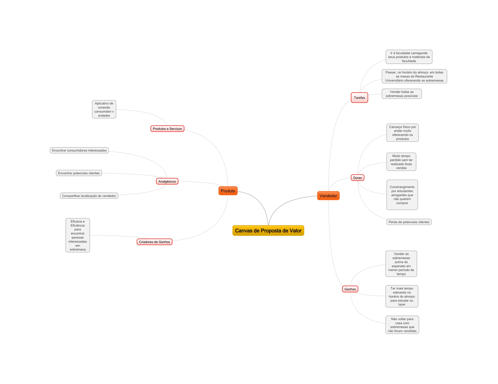

## Introdução

Esse documento tem o intuito de guiar os principais objetivos a nível de negócio do produto, fazendo com que o objetivo seja claro.

## Personas

Com o auxílio do mapa de empatia, construiu-se duas personas representando os potenciais usuários do produto que representa a parte do vendedor e do consumidor.

* Vendedor

Ana tem 20 anos, é estudante do sexto semestre do curso de engenharia eletrônica na FGA e está em busca de alcançar a formação no tempo estipulado, ao mesmo tempo faz o estágio obrigatório do curso, sendo que mora a mais de 40km da faculdade e do estágio. Vende cupcakes recorrentemente nos horários de almoço quando está presente na FGA aos estudantes para que ela possa ter mais dinheiro e auxilie também nos custos em casa.

* Comprador

Jonas tem 19 anos, estudante quarto semestre da do curso de engenharia aeroespacial, pretense se formar a tempo, apesar de estar se atrasando em algumas matérias. Gosta muito de sobremesas após o almoço para que tenha uma melhor sensação de satisfação e, por isso, eventualmente compra de alguns vendedores que vendem durante o almoço na faculdade, porém nem sempre consegue comprar por conta de não achar o produto ou vendedor.

## Canvas de Proposta de Valor

### Vendedor

]

### Comprador

## Canvas de Modelo de Negócios

