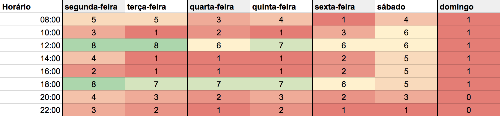

Esse documento descreve o plano metodológico que será seguido no desenvolvimento do projeto além de detalhar as técnicas e os rituais que serão aplicados.

# 1 Papéis
## 1.1 Scrum Master
O Scrum Master tem como responsabilidade:
* Definir, adaptar e aplicar a metodologia de desenvolvimento que será utilizada na construção do produto;
* Definir métricas para analisar e melhorar a produtividade da equipe com base nos dados coletados;
* Garantir a execução da metodologia definida nesse documento.

## 1.2 Product Owner (PO)
O PO tem como responsabilidade:
* Definir escopo do produto com base nas necessidades dos *stakeholders*;
* Definir proposta de valor do produto;
* Analisar custos e a rentabilidade do projeto;
* Definir critérios de aceitação para as histórias de usuário;
* Definir e analisar métricas para garantir a entrega de valor do produto aos stakeholders;

## 1.3 Arquiteto
O Arquiteto tem como responsabilidade:
* Modelar e planejar a arquitetura do sistema;
* Acompanhar o desenvolvimento do produto para garantir que a arquitetura está sendo seguida.

## 1.4 DevOps
O DevOps tem como responsabilidade:
* Definir a política de contribuição para o projeto;
* Garantir a disponibilidade dos ambientes de desenvolvimento, homologação e produção;
* Garantir a integração e o *deploy* contínuo;
* Garantir o *gitflow*.

## 1.5 Desenvolvedor
O Desenvolvedor tem como responsabilidade:
* Seguir a metodologia e os rituais definidos pelo Scrum Master;
* Desenvolver o produto;
* Testar as soluções implementadas durante o desenvolvimento do produto garantindo uma cobertura de testes de pelo menos 90% do código;
* Seguir padrões, técnicas e boas práticas de programação definidas pelo Scrum Master.

---
# 2 Rituais
## 2.1 Sprints
A *sprint* é um período de tempo definido durante o qual é produzida uma versão incremental do produto. Uma *sprint* inicia imediatamente após a conclusão da *sprint* anterior e tem o objetivo de entregar um incremento potencialmente utilizável do produto [[1]](#7-referencias). As *sprints* do atual projeto terá as seguintes características:
* Duração: 7 dias;
* Todas as *sprints* começarão às 14 horas do sábado e se encerrarão 9 horas do sábado seguinte dando início, respectivamente, aos rituais de Revisão da *sprint*, Retrospectiva da *sprint*, Planejamento da *sprint* e Definição de riscos.

## 2.2 Daily Meeting
As *daily meetings* são a documentação do trabalho diário dos membros da equipe que serão utilizados para registrar o progresso do desenvolvimento do produto e observar as dificuldades encontradas pelos membros. A daily meeting terá as seguintes características:
* Duração: Máximo 10 minutos;
* Serão estruturadas em três tópicos a serem respondidos:
	* "O que foi feito?"
	* "O que será feito?"
	* "Quais foram as dificuldades?"

Para verificar qual seria o melhor horário para fazer as *dilies meetings* durante a semana, foi feito um mapa de calor da disponibilidade da equipe.

Verificando o quadro de disponibilidade foi definido com a equipe as seguintes características:
* As *dailies meetings* presenciais acontecerão nas segundas, terças e quintas às 18 horas;
* Para suprir a falta de encontros presenciais, nos outros dias as *dailies meetings* serão documentadas em um canal de texto nomeado "#daily" no Discord.

## 2.3 Revisão da Sprint
Uma reunião informal para validar o incremento do produto produzido na *sprint* atual e adaptar o *backlog* do produto se necessário [[1]](#7-referencias). No caso do deste processo de desenvolvimento nem todos os *stakeholders* estarão presentes na revisão do incremento do produto, pois a parte interessada analisará o produto em outro momento. A Revisão da *Sprint* terá as seguintes características:
* Duração de 1 hora;
* Envolverá a equipe de desenvolvimento, o Scrum Master, o PO, o Arquiteto e o DevOps.

## 2.4 Retrospectiva da Sprint
Ocorrendo após a Revisão da *sprint*, a Retrospectiva da *sprint* será o momento da equipe inspecionar a si própria criando assim um plano para melhorias a serem aplicadas na próxima *sprint* [[1]](#7-referencias). A Retrospectiva da *sprint* terá as seguintes características:
* Duração: 30 minutos;
* Será documentada anonimamente seguindo os tópicos:
	* Pontos positivos: Cada membro da equipe apontará pontos positivos da equipe durante a *sprint* que ocorreu;
	* Pontos de melhoria: Cada membro da equipe apontará pontos melhoria da equipe durante a *sprint* que ocorreu;
	* Sugestões de melhoria: Cada membro apresentará sugestões para solucionar os pontos de melhoria observados na *sprint* e, após a sugestão ser discutida pela equipe, as sugestões serão colocadas em prática.

## 2.5 Planejamento da Sprint
Com a colaboração de todo os papéis, é planejado o trabalho a ser realizado na *sprint*. Tendo como tarefa principal do Scrum Master garantir a execução do ritual o entendimento dos participantes sobre o propósito do mesmo [[1]](#7-referencias). O Planejamento da *sprint* terá as seguintes características:
* Duração: 3 horas;
* Primeiramente o PO analisa os Temas de negócio e, se necessário, extrai seus Épicos. A partir disso, os Épicos são analisados e são criadas, se necessário, Histórias de Usuário (US) com seus critérios de aceitação;
* As US são pontuadas pela equipe de desenvolvimento usando o *planning poker*;
* Depois de pontuadas as US, o PO e o Scrum Master definem quais US serão produzidas na *sprint*;
* O Scrum Master divide a equipe de desenvolvimento em pares e define os responsáveis pelo desenvolvimento das US escolhidas.

## 2.6 Identificação de riscos
A etapa de identificação de riscos se encontra tanto no início do projeto quanto durante todo o desenvolvimento. Listar os riscos externos e internos em tabelas ou planilhas é o indicado para uma boa identificação de riscos [[2]](#7-referencias). Neste projeto, os riscos serão identificados e pontuados no ritual de Identificação de riscos a cada *sprint* que terá as seguintes características:
* Duração: 1 hora;
* Com a colaboração de todos os papéis, a equipe identifica e lista os riscos internos e externos da *sprint*.
* Usando o *planning poker* a equipe define pontuações para os riscos demonstrando quais são os maiores riscos para o projeto e a equipe na *sprint* em que eles foram pontuados.

---
# 3 Ferramentas de planejamento
## 3.1 Issues
As *issues* no Github serão utilizadas para representar todas as tarefas que a equipe realizará durante a produção do software. Para a melhor identificação dessas tarefas as *issues* devem ter os seguintes atributos:
* Nome
* Descrição
* *Label*
* Responsáveis

### 3.1.1 Labels
As labels serão dividídas por identificadores para garantir que todas as características das issues serão definidas.
0 - Papel responsável;
1 - Tecnologia abordada;
2 - Assunto relacionado;
3 - Característica da issue.

## 3.2 Épicos
Os Épico provê uma camada extra na hierarquia das Issues definindo um tema que agrupa tarefas que serão realizadas e se comportando como grandes US [[3]](#7-referencias)[[4]](#7-referencias). No desenvolvimento do produto os Épicos terão o objetivo de agrupar US e terão os seguintes atributos:
* Código: EP## (#: número da EP);
* Nome: <código> - Eu como <ator> gostaria de <funcionalidade de alto nível> para <valor atribuído para o stakeholder>;
* Lista de USs atreladas ao Épico.

## 3.3 Histórias de Usuário (US)
As USs são descrições de alto nível de funcionalidades que definem incrementos no produto pela perspectiva dos *stakeholders* [[4]](#7-referencias). As USs serão documentadas nao GitHub como *issues* (seguindo todas as regras definidas anteriormente para *issues*) que obrigatoriamente deverão estar atreladas a Épicos e seguirão um template definido:
* Código/Nome: US## (#: número da US);
* Descrição: Eu como <ator> gostaria de <funcionalidade> para <valor atribuído para o *stakeholder*>;
* Tarefas: Lista de atividades que levam a produção da funcionalidade;
* Requisitos: Critérios de aceitação.

## 3.4 Milestones
As *Milestones* no GitHub são análogas às *sprints* definindo um período de tempo e documentando no repositório quais atividades serão realizadas em um determinado período [[4]](#7-referencias).

## 3.5 Planning Poker
O *Planning Poker* é um método de estimar *Story Points* (medida relativa de de esforço, complexidade e risco) a partir de comparações de tamanho relativo entre as US [[5]](#7-referencias). No projeto o *planning poker* será usado para estimar tanto as US quanto os riscos em uma determinada *sprint* com o auxílio do aplicativo Scrum Poker Cards [[6]](#7-referencias) que simula as cartas escritas com a sequência de Fibonacci.

## 3.6 Kanban
Para monitorar o trabalho da equipe será utilizado dois quadros de Kanban no *Projects* do GitHub:
* Quadro de desenvolvimento para manter o controle da produção das US que será dividido em Product Backlog, Sprint Backlog, In Progress, Testing e Done;
* Quadro geral para manter o controle de todas as outras atividades relacionadas ao produto como produção de documentos, reuniões, treinamentos, estudos e etc. Este quadro será dividido em To do, In progress e Done.

---
# 4 Métricas de gerenciamento
## 4.1 Velocity
O *velocity* é uma medida de *story points* concluídos em um determinado período de tempo, no caso desse projeto o tempo seria as *sprints* semanais. Essa medida apresenta a taxa de entrega de trabalho pela equipe e isso possibilita estimativas mais acuradas de *story points* que podem ser atribuídos ao time por *sprint* [[4]](#7-referencias).

Inicialmente a estimativa feita pode não ser tão acurada, mas com o passar das *sprits* essa acurácia tende a aumentar.

## 4.2 Burndown
O *burndown* mostra o trabalho que está completo relacionado com o *velocity* do projeto. O gráfico de *burndown* mostra como as projeto está andando, o que apresenta uma boa noção de quantos *story points* podem ser realizados em uma determinada *sprint* [[4]](#7-referencias).

## 4.3 Quadro de conhecimento
O quadro de conhecimentos representa como está o conhecimento de cada indivíduo da equipe em tecnologias e métodos que serão chave para o desenvolvimento do projeto. Esse quadro auxilia na identificação dos possíveis riscos internos no projeto e na estimativa inicial de capacidade de trabalho da equipe. A medição dos dados de conhecimento terão as seguintes características:
* Quando: A medição do conhecimento da equipe será feita no começo do projeto e antes de cada *release*;
* Como: Entro de cada tópico o nível de conhecimento será pontuado em Baixo - 1, Médio - 3, Alto - 5.

## 4.4 Riscos
Os riscos do projeto serão divididos em riscos internos e externos e serão descritos em tabelas [[2]](#7-referencias). Os riscos serão elicitados e pontuados a cada *sprint*.

---
# 5 Técnicas de codificação
## 5.1 Programação em pares
A programação em pares é uma prática extraída do *Extreme Programing* (XP) na qual um par de desenvolvedores ficam responsáveis por produzir uma funcionalidade juntos, sendo um o piloto e o outro o co-piloto. Ambos os desenvolvedores devem trabalhar ao mesmo tempo e no mesmo computador de maneira que o piloto codifica e o co-piloto acompanha o trabalho deste. É mandatório que os desenvolvedores invertam seus papéis periodicamente [[7]](#7-referencias).

Ao decorrer do projeto o *Scrum Master* será responsável por redefinir os pares do Time de Desenvolvimento a cada *sprint* para garantir a homogeneidade da equipe. No entando, a partir da primeira release os pares serão distribuidos aleatoriamente uma vez que a maturidade do Time de Desenvolvimento estará garantida.

O quadro de pareamento será o seguinte:
|  Sprints  |        Par 1       |        Par 2       | Par 3              |
|:---------:|:------------------:|:------------------:|--------------------|
| sprint 3  |   André e Welison  |  Gustavo e Dâmaso  | Shayene e Leonardo |
| sprint 4  |   André e Gustavo  |  Leonardo e Dâmaso | Shayene e Welison  |
| sprint 5  |  André e Leonardo  |  Welison e Dâmaso  | Shayene e Gustavo  |
| sprint 6  | Leonardo e Gustavo | André e Welison    | Shayene e Dâmaso   |
| sprint 7  | André e Dâmaso     | Leonardo e Welison | Gustavo e Shayene  |
| sprint 8  | André e Gustavo    | Welison e Dâmaso   | Shayene e Leonardo |
| sprint 9  | André e Shayene    | Gustavo e Welison  | Leonardo e Dâmaso  |
| sprint 10 | André e Leonardo   | Shayene e Welison  | Gustavo e Dâmaso   |
| sprint 11 | André e Welison    | Gustavo e Leonardo | Shayene e Dâmaso   |
| sprint 12 | André e Dâmaso     | Leonardo e Welison | Gustavo e Shayene  |
| sprint 13 | André e Gustavo    | Welison e Dâmaso   | Shayene e Leonardo |
| sprint 14 | André e Shayene    | Gustavo e Welison  | Leonardo e Dâmaso  |
| sprint 15 | André e Leonardo   | Shayene e Welison  | Gustavo e Dâmaso   |
| sprint 16 | André e Welison    | Gustavo e Leonardo | Shayene e Dâmaso   |

---
# 6 Comunicação
Os princiapais canais de comunicação da equipe serão:
* Telegram
	* Os grupos no Telegram serão utilizados para garantir uma comunicação rápida entre os membros da equipe;
	* Será utilizado para avisos em geral que serão fixados no grupo, garantindo que todos os membros possam ser avisados.
* Discord
	* O Discord será o principal canal para se fazer reuniões remotas;
	* Os pares serão encorajados a se comunicarem pelo por canais do Discord, garantindo a transparência na atividade dos desenvolvedores;
	* O Discord também terá canais para compartilhamento de conhecimento entre os membros, o qual será usado para guardar links e artigos;
	* O Discord também terá um canal para documentar as *Dailies Meetings* como descrito no [tópico 2.2](#22-daily-meeting).
* Google Drive
	* Haverá uma pasta no Google Drive para o compartilhamento de documentos;
	* A pasta também terá os documentos de métricas para garantir o fácil acesso da equipe para coleta de dados.
* Github
	* O GitHub será a principal ferramenta para documentar as tarefas (em forma de *issues*) e a quem eles estão delegadas;
	* A partir das *issues* os membros da equipe podem adicionar comentários sobre uma determinada *issue* para tirar dúvidas ou fazer considerações;
---
# 7 Referências
[[1]](#7-referencias) SCHWABER, Ken; SUTHERLAND, Jeff. **Um guia definitivo para o Scrum**: As regras do jogo. Scrum Inc, 2013. 19 p.

[[2]](#7-referencias) JUNCKES, Gabriel Dias; MORGADO, Paulo. **Gerência de riscos em desenvolvimento de software**. 2013. Universidade do Sul de Santa Catarina. Disponível em: <https://www.devmedia.com.br/gerencia-de-riscos-em-desenvolvimento-de-software/28506>. Acesso em: 5 set. 2018.

[[3]](#7-referencias) PAQUETTE, Paige. **Working with Epics inside GitHub**: Introducing ZenHub Epics. 2016. Disponível em: <https://www.zenhub.com/blog/working-with-epics-in-github/>. Acesso em: 06 set. 2018.

[[4]](#7-referencias) BUTLER, Matt; PAQUETTE, Paige. **Better So ware & Stronger Teams**: Project Management for GitHub. Zenhub, 2016. Disponível em: <https://www.zenhub.com/github-project-management.pdf>. Acesso em: 04 set. 2018.

[[5]](#7-referencias) BRASILEIRO, Roberto. **Planning Poker**: A melhor maneira de estimar qualquer atividade. 2017. Disponível em: <http://www.metodoagil.com/planning-poker/>. Acesso em: 07 set. 2018.

[[6]](#7-referencias) artArmin. **Scrum Poker Cards**. Disponível em: <https://play.google.com/store/apps/details?id=artarmin.android.scrum.poker>. Acesso em: 07 set. 2018.

[[7]](#7-referencias) MEDEIROS, Manoel Pimentel. **Implementando Pair Programming em sua equipe**: Conhecendo as dificuldades e as vantagens dessa prática XP. 2007. Disponível em: <https://www.devmedia.com.br/implementando-pair-programming-em-sua-equipe/1694>. Acesso em: 8 set. 2018.