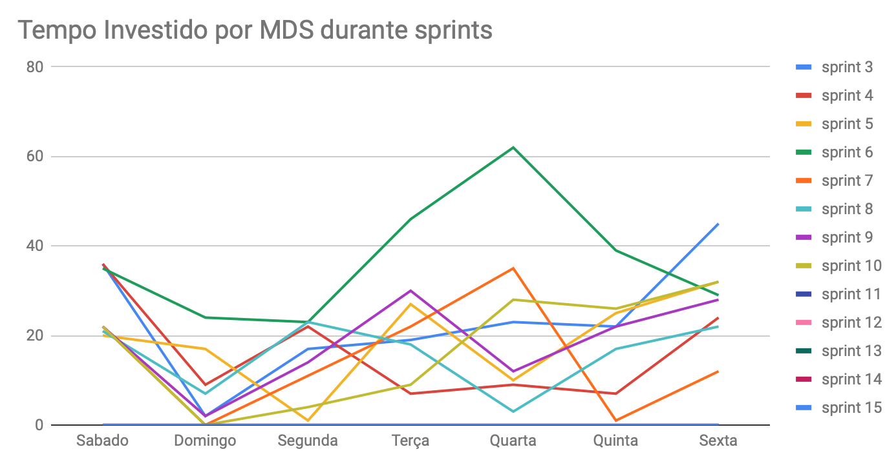
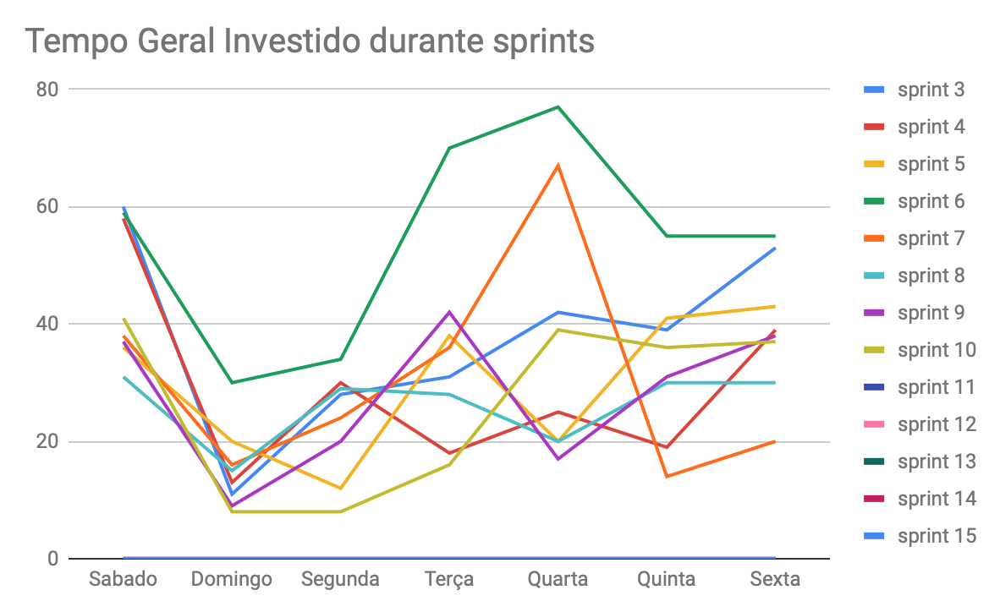
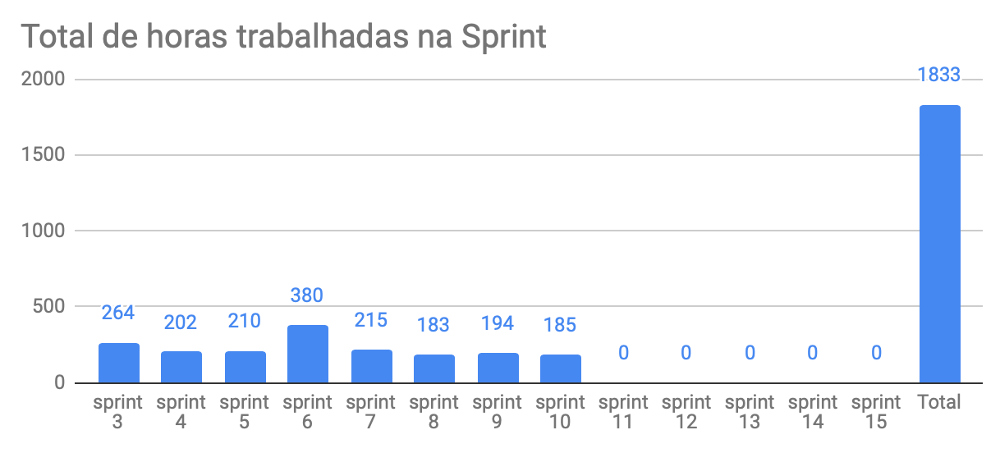
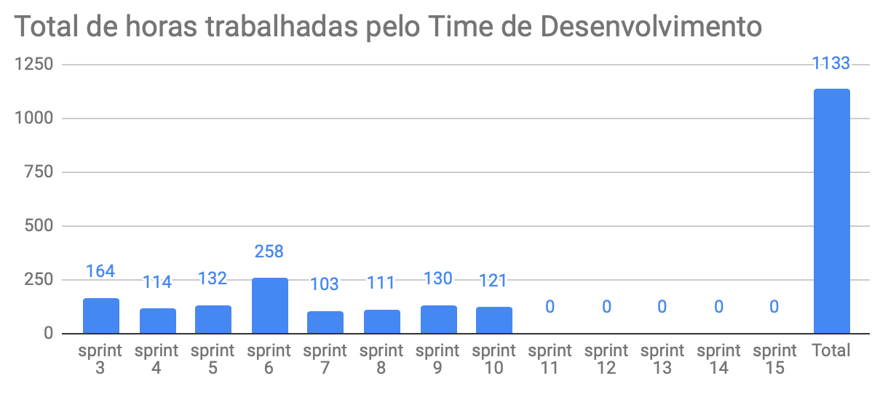
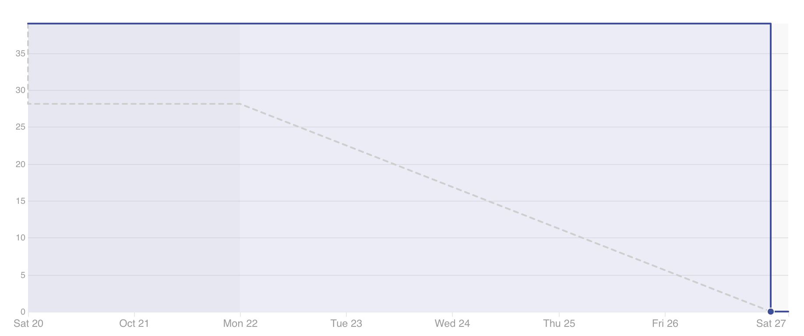

# Lista de presença no planejamento
|Nome|Presença|
|----|:------:|
|Lucas Costa|OK|
|Lucas Pereira|OK|
|Ricardo Canela|OK|
|Wesley Araujo|OK|
|André Pinto|Faltou|
|Dâmaso Pereira|OK|
|Gustavo Lima|OK|
|Leonardo Medeiros|Faltou|
|Shayane Alcântara|OK|
|Welison Almeida|OK|

# Planejamento da Sprint
|Par|História|Pontos|
|---|:------:|:----:|
|[André Pinto](https://github.com/andrelucax) e [Leonardo Medeiros](https://github.com/leomedeiros1)|TS11|13|
|[Welison Almeida](https://github.com/WelisonR) e [Shayane Alcântara](https://github.com/shayanealcantara)|TS10|21|
|[Gustavo Lima](https://github.com/gustavolima00) e [Dâmaso Pereira](https://github.com/juniopereirab)|US22|21|
|Não foi assumida por nenhuma dupla|TS12|21|

-------------------------------------------------------------------------------
# Retrospectiva da Sprint
## Pontos positivos
1. Empenho do time de desenvolvimento;

2. Forte comunicação interna por issues;

3. Maior experiência da equipe para resolver problemas e transpor dificuldades;

4. Duplas colaborativas.

## Pontos de melhoria
1. Anteceder plano B caso a sprint esteja limitada por tempo que outras disciplinas consomem;

2. PR's acumulados;

3. Dificuldades no ambiente de desenvolvimento;

4. Muitos testes a serem feitos no frontend;

## Medidas a serem tomadas
1. Priorizar histórias de teste, tanto no frontend quanto backend;

2. Ajustes no ambiente de desenvolvimento;

3. Reunir a equipe e separar um tempo para dedicar à aceitação de PR's;

## Melhorias
1. Maior clareza nas histórias de usuário e tarefas.

-------------------------------------------------------------------------------
# Revisão da Sprint
* A [TS11](https://github.com/fga-eps-mds/2018.2-Integra-Vendas/issues/227) tiveram os componentes testados, entretando houveram muitas dúvidas sobre teste de transição de telas.

* A [TS10](https://github.com/fga-eps-mds/2018.2-Integra-Vendas/issues/226) tiveram todos os critérios atingidos.

* A [US22](https://github.com/fga-eps-mds/2018.2-Integra-Vendas/issues/206) tiveram a maioria dos critérios atingidos, entretanto não estava sendo possível obter o token do celular para poder integrar com o backend, por esse motivo se tornou dívida técnica.
-------------------------------------------------------------------------------
# Métricas
## Horas durante a sprint

## Horas totais

## Burndown
