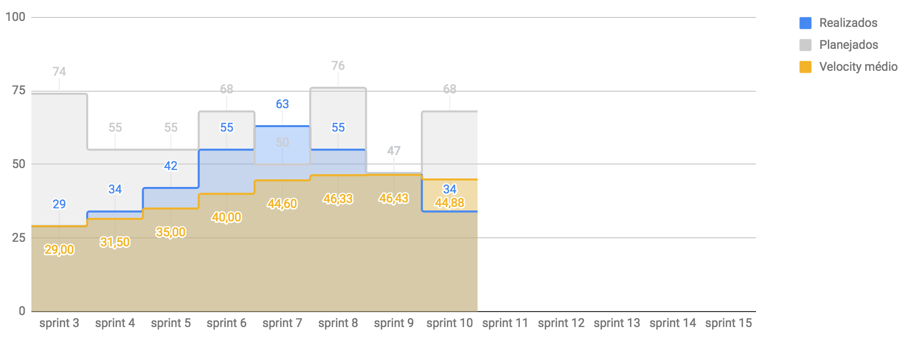

# Planejamento da Sprint
|Par|História|Pontos|
|---|:------:|:----:|
||||
||||
||||

-------------------------------------------------------------------------------
# Retrospectiva da Sprint
## Pontos positivos
1. 

## Pontos de melhoria
1. 

## Medidas a serem tomadas
1. 

## Melhorias
1. 

-------------------------------------------------------------------------------
# Revisão da Sprint
* 
-------------------------------------------------------------------------------
# Métricas
<!-- ## Horas durante a sprint

## Horas totais

## Velocity

## Burndown
 -->