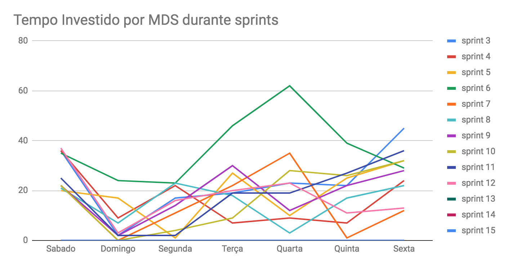
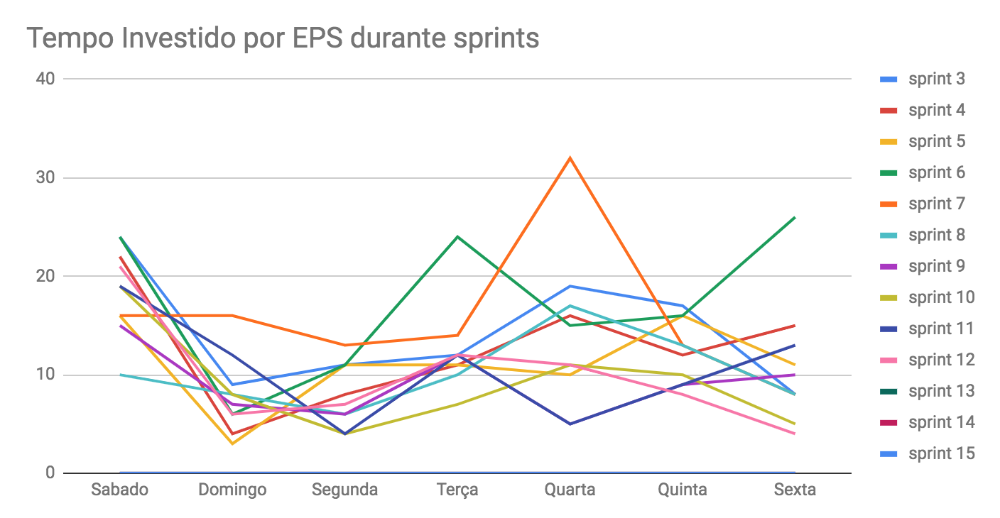
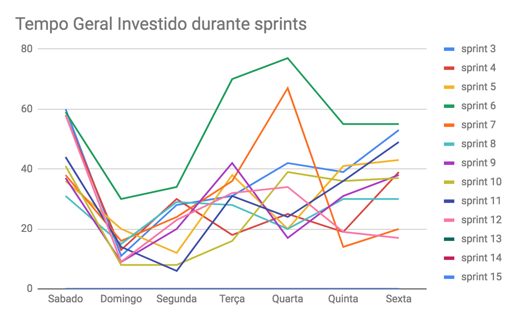
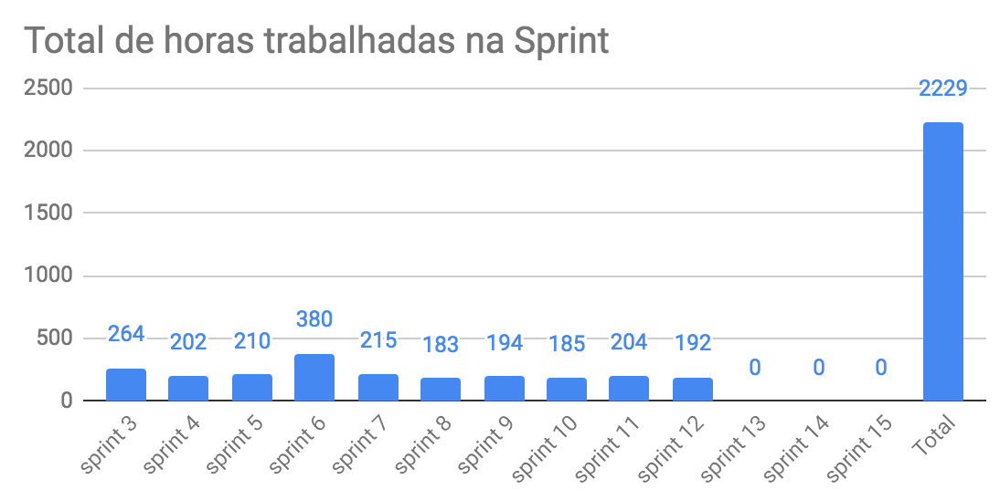
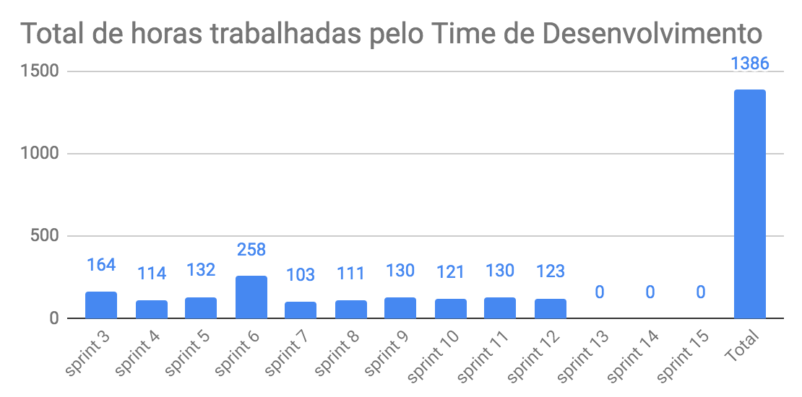

# Lista de presença no planejamento
|Nome|Presença|
|----|:------:|
|Lucas Costa|OK|
|Lucas Pereira|OK|
|Ricardo Canela|OK|
|Wesley Araújo|Atrasado|
|André Pinto|OK|
|Dâmaso Pereira|Atrasado|
|Gustavo Lima|OK|
|Leonardo Medeiros|OK|
|Shayane Alcântara|OK|
|Welison Almeida|OK|

# Planejamento da Sprint
|Par|História|Pontos|
|---|:------:|:----:|
|[André Pinto](https://github.com/andrelucax) e [Dâmaso Pereira](https://github.com/juniopereirab)|TS13|13|
|[Gustavo Lima](https://github.com/gustavolima00) e [Shayane Alcântara](https://github.com/shayanealcantara)|TS12|21|
|[Welison Almeida](https://github.com/WelisonR) e [Leonardo Medeiros](https://github.com/leomedeiros1)|US24 e TS15|8 + 5|

-------------------------------------------------------------------------------
# Retrospectiva da Sprint
## Pontos positivos
1. Comunicação e integração dos membros da equipe;
2. A equipe está empenhada e compromissada com o trabalho;
3. As *dailies* estão ajudando na comunicação;
4. As histórias concluídas agregam muito ao produto e sua qualidade;
5. Algumas duplas elogiaram o trabalho cooperativo do pareamento.

## Pontos de melhoria
1. Uma dupla teve um desentendimento impossibilitou o pareamento durante a sprint;
2. Atrasos;
3. Estão acontecendo alguns estresses na equipe na interação com alguns membros;
4. PRs acumulados;
5. Documentação das sprints ainda está atrasada;
6. A qualidade dos microsserviços deve ser melhorada;

## Medidas a serem tomadas
1. Conversar com os membros e resolver o problema entre a dupla;
2. Reforçar o compromisso dos membros com os horários estabelecidos;
3. Conversar com toda a equipe sobre os conflitos ocorridos. Provavelmente estão todos cansados com o final do semestre;
4. Focar na resolução dos PRs acumulados durante o final de semana para os trabalhos da semana começarem bem;
5. Distribuir atividades de documentação para mais de um membro;
6. Fazer histórias para a melhoria do código;

## Melhorias
1. O problema que ocorreu com a dupla foi discutido e resolvido;
2. Houve uma diminuição nos atrasos e nas faltas;
3. Os membros desabafaram sobre o que estava os incomodando. A sinergia da equipe foi colocada a prova e todos parecem confortáveis para relatar seus problemas;

-------------------------------------------------------------------------------
# Revisão da Sprint
* A [TS13](https://github.com/fga-eps-mds/2018.2-Integra-Vendas/issues/229) não foi completa, pois não satisfez o critério de aceitação de atingir 80% de cobertura nos testes dos arquivos do front-end propostos pela história.
* A [TS12](https://github.com/fga-eps-mds/2018.2-Integra-Vendas/issues/228) foi feita por completo e atingiu todos os critérios de aceitação.
* A [US24](https://github.com/fga-eps-mds/2018.2-Integra-Vendas/issues/271) foi feita por completo e atingiu todos os critérios de aceitação.
* A [TS15](https://github.com/fga-eps-mds/2018.2-Integra-Vendas/issues/270) foi feita por completo e atingiu todos os critérios de aceitação.
* Foi feita a [Issue #29](https://github.com/fga-eps-mds/2018.2-FGAPP-login/issues/29) no repositório do microsserviço de login para resolver um bug. Essa issue teve o valor de 5 pontos.

-------------------------------------------------------------------------------
# Métricas
## Horas durante a sprint

## Horas totais

## Velocity

## Burndown
