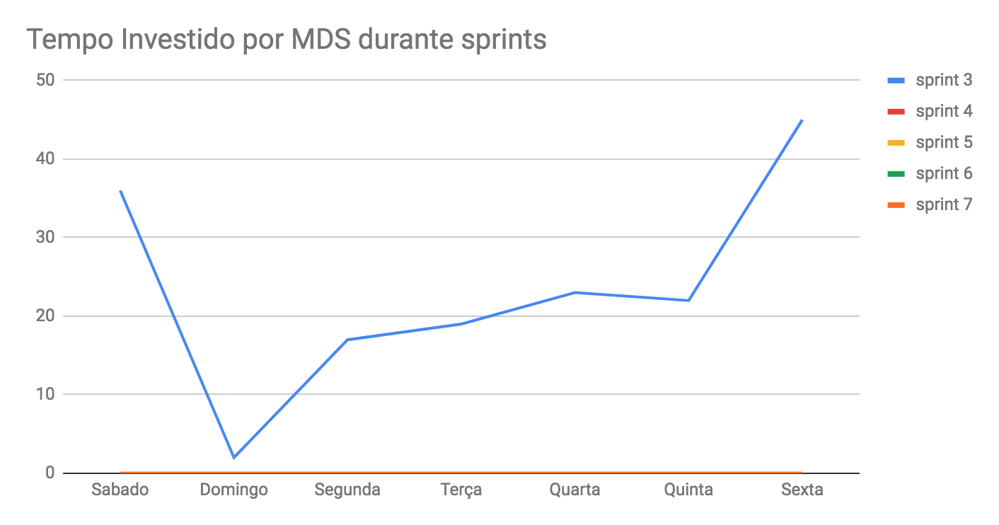
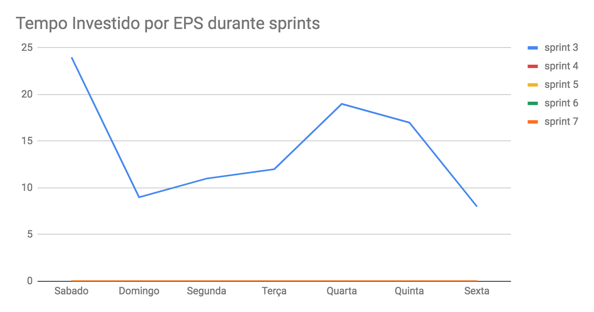
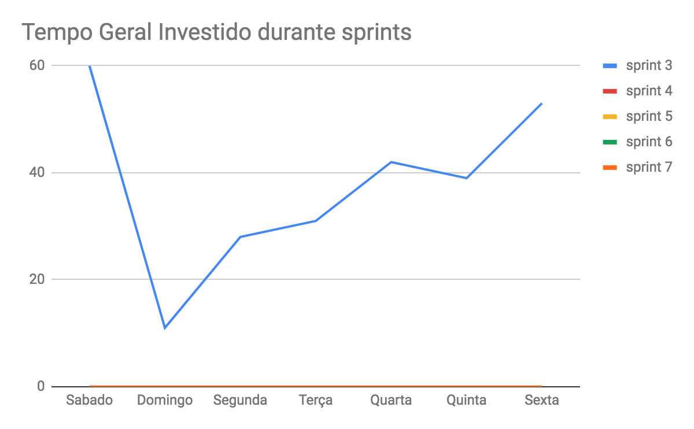
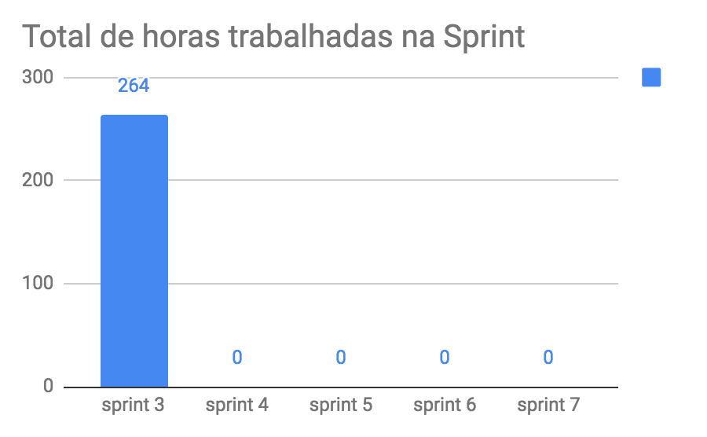
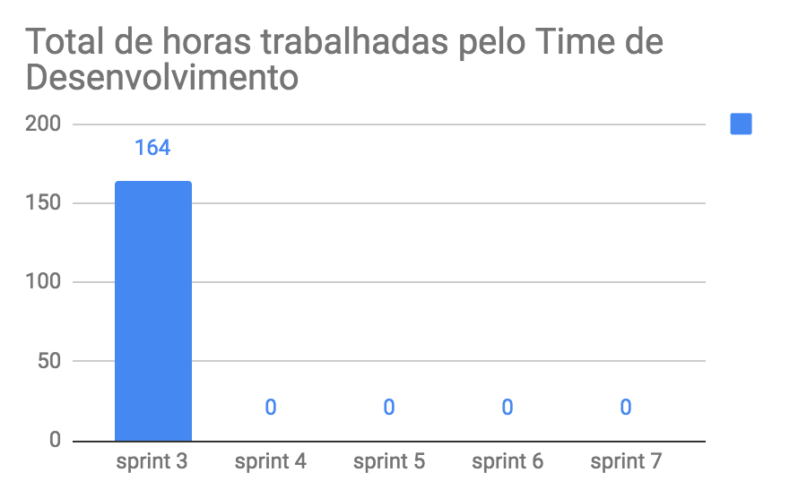
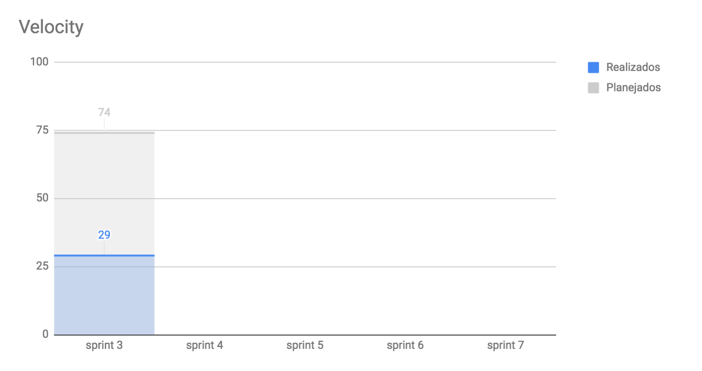
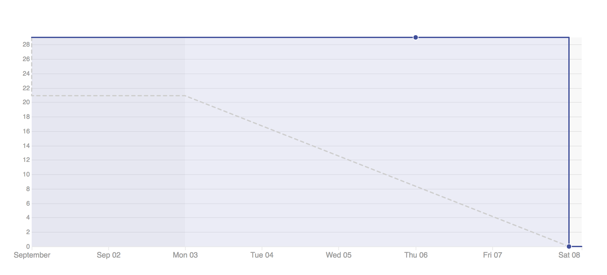

# Planejamento da Sprint
|Par|História|Pontos|
|---|:------:|:----:|
|[André Pinto](https://github.com/orgs/fga-eps-mds/people/andrelucax) e [Welison Almeida](https://github.com/orgs/fga-eps-mds/people/WelisonR)|US04 e US07|29|
|[Gustavo Lima](https://github.com/orgs/fga-eps-mds/people/gustavolima00) e [Dâmaso Pereira](https://github.com/orgs/fga-eps-mds/people/juniopereirab)|US08 e US10|29|
|[Shayane Alcântara](https://github.com/orgs/fga-eps-mds/people/shayanealcantara) e [Leonardo Medeiros](https://github.com/orgs/fga-eps-mds/people/leomedeiros1)|US01 e US02|16|

-------------------------------------------------------------------------------
# Retrospectiva da Sprint
## Pontos positivos
1. Apoio de Devops com o Docker;
2. Comunicações entre os membros da equipe;
3. Ajuda dos integrantes de EPS;
4. Toda a equipe é proativa e participativa;
5. Ambiente de desenvolvimento estável;
6. A equipe de desenvolvimento ganhou muito conhecimento no desenvolvimento do projeto;
7. Alguns membros da equipe de desenvolvimento gostaram de programar com pares;
8. Sinergia entre os membros da equipe.

## Pontos de melhoria
1. A configuração dos ambientes de desenvolvimento estão lentas;
2. Atraso no preenchimento da *daily*;
3. Dificuldade de realizar testes no código por falta de conhecimento;
4. Alguns membros da equipe de desenvolvimento não gostaram de fazer programação em pares, pois eles se sentem mais produtivos trabalhando sozinhos.

## Medidas a serem tomadas
1. Concentrar priorizar a configuração de ambientes de desenvolvimento que afetam diretamente o trabalho de desenvolvimento proposto na sprint;
2. Lembrar diariamente sobre as *dailies*;
3. Fazer aula de testes unitários em Django;
4. Organizar os pares para deixar os membros mais confortáveis ao fazer pareamento.

## Melhorias
1. Os horários das reuniões foram respeitados;
2. Tema bem defino e claro para todos os membros da equipe;
3. Entendimento melhor da cominicação da API com o *front-end*;
4. Reuniões ficaram o o objetivo mais claro, mas ainda há perda de tempo no decorrer da reunião.

-------------------------------------------------------------------------------
# Revisão da Sprint
* A US04 entregou valor, pois preencheu todos os critérios de aceitação. No entanto, gerou a TS01 para o desenvolvimento de testes unitários das funcionalidades implementadas.
* A US07 entregou valor, pois preencheu todos os critérios de aceitação. No entanto, gerou a TS02 para o desenvolvimento de testes unitários das funcionalidades implementadas.
* A US08 não preencheu todos os critérios de aceitação.
* A US10 não preencheu todos os critérios de aceitação.
* A US01 não preencheu todos os critérios de aceitação.
* A US02 não começou a ser desenvolvida.

-------------------------------------------------------------------------------
# Métricas
## Horas durante a sprint

## Horas totais

## Velocity

## Burndown
