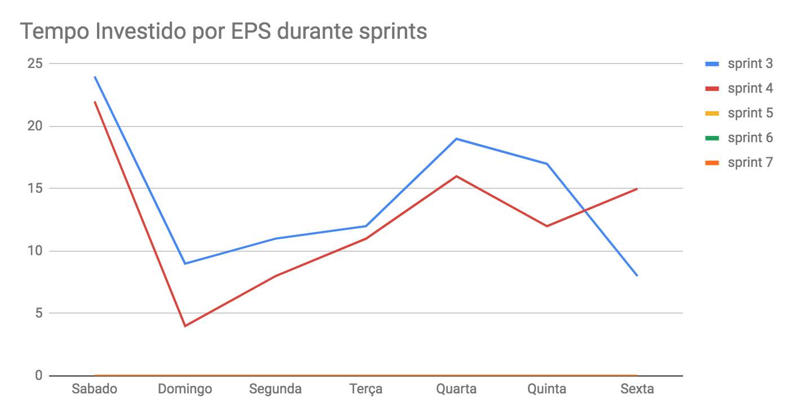
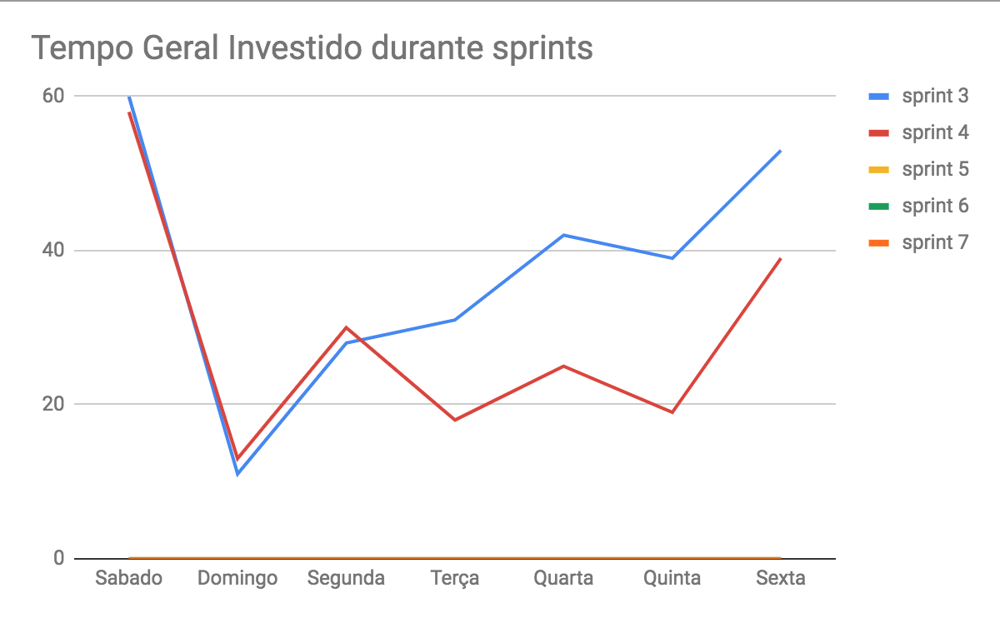
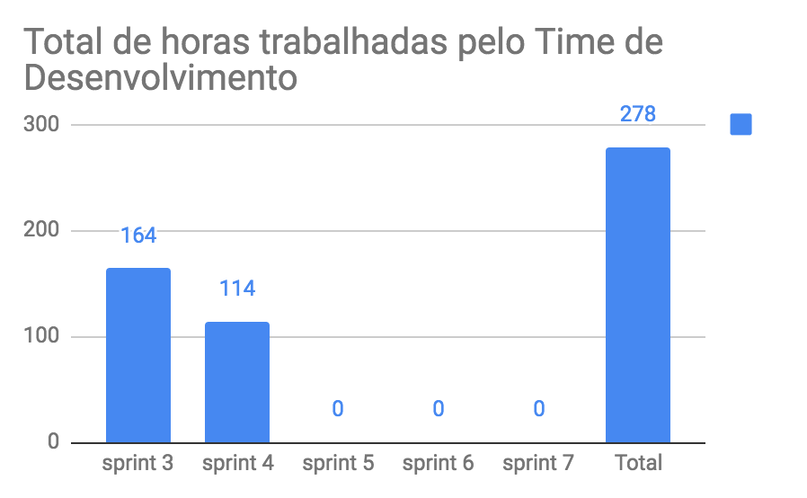
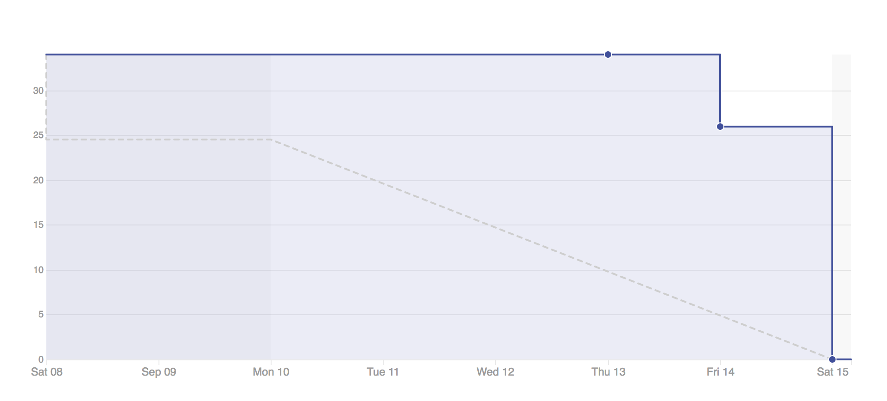

# Planejamento da Sprint

|Par|História|Pontos|
|---|:------:|:----:|
|[Gustavo Lima](https://github.com/orgs/fga-eps-mds/people/gustavolima00) e [André Pinto](https://github.com/orgs/fga-eps-mds/people/andrelucax)|US01|21|
|[Leonardo Medeiros](https://github.com/orgs/fga-eps-mds/people/leomedeiros1) e [Dâmaso Pereira](https://github.com/orgs/fga-eps-mds/people/juniopereirab)|TS01 e TS02|13|
|[Welison Almeida](https://github.com/orgs/fga-eps-mds/people/WelisonR) e [Shayane Alcântara](https://github.com/orgs/fga-eps-mds/people/shayanealcantara)|US08|21|

-------------------------------------------------------------------------------
# Riscos
## Riscos Internos
|Risco interno|Medidas|Pontuação|
|:------------|:------|:-------:|
| | | |
| | | |

## Riscos Externos
|Risco externo|Medidas|Pontuação|
|:------------|:------|:-------:|
| | | |
| | | |

-------------------------------------------------------------------------------
# Retrospectiva da Sprint
## Pontos positivos
1. A equipe se sentiu mais produtiva, pois entregou mais pontos na sprint;
2. Equipe proativa;
3. Sinergia entre os membros da equipe;
4. Disponibilidade da equipe para ajudar com as dúvidas que aparecem;
5. Aula de testes;
6. Boa interação entre os pares.

## Pontos de melhoria
1. Os problemas não estão sendo comunicados efetivamente;
2. Falta de clareza nas histórias;
3. Dificuldade de entender como o software deve ser estruturado.

## Medidas a serem tomadas
1. Aumentar o número de dailies presenciais na semana;
2. Escrever as critérios de aceitação te todas as histórias que estão no Product Backlog;
3. Criar diagrama de Classes.

## Melhorias
1. Todos se sentiram mais confortáveis com o pair programing;
2. Os membros estão mais comprometidos para escrever as dalies, mas ainda não está perfeito;
3. A equipe compreendeu um pouco melhor sobre o que deve ser feito nos testes;
4. Todos os ambientes de desenvolvimento estão configurados para o time de desenvolvimento trabalhar.

-------------------------------------------------------------------------------
# Revisão da Sprint
* A [US01](https://github.com/fga-eps-mds/2018.2-iFood/issues/36) entregou valor, pois preencheu todos os critérios de aceitação. No entanto, gerou a [TS04](https://github.com/fga-eps-mds/2018.2-iFood/issues/82) para o desenvolvimento de testes unitários das funcionalidades implementadas.
* A [TS01](https://github.com/fga-eps-mds/2018.2-iFood/issues/78) foi feita por completo.
* A [TS02](https://github.com/fga-eps-mds/2018.2-iFood/issues/79) foi feita por completo.
* A [US08](https://github.com/fga-eps-mds/2018.2-iFood/issues/46) não preencheu todos os critérios de aceitação.

-------------------------------------------------------------------------------
# Métricas
## Horas durante a sprint

## Horas totais

## Velocity

## Burndown
