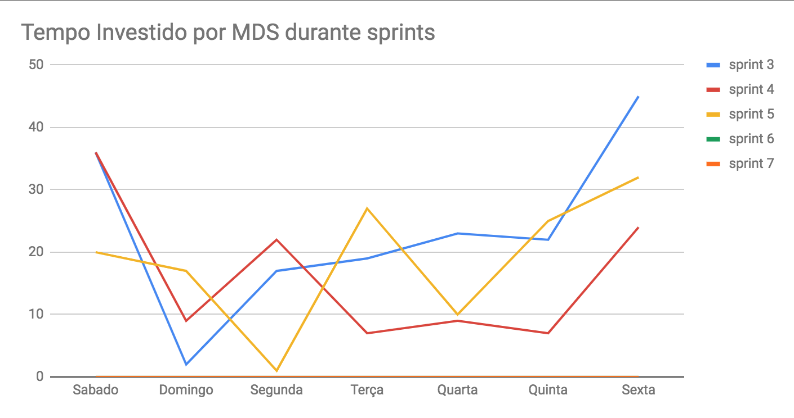
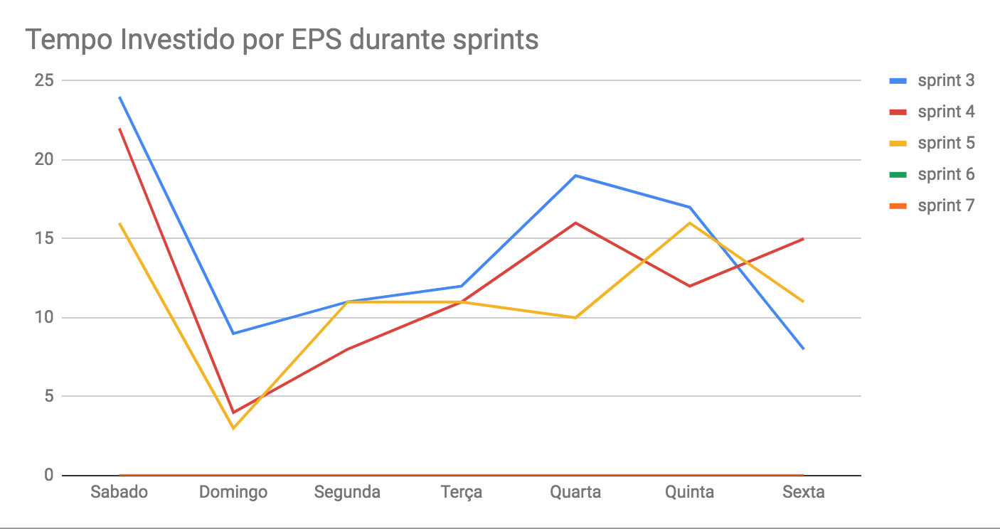
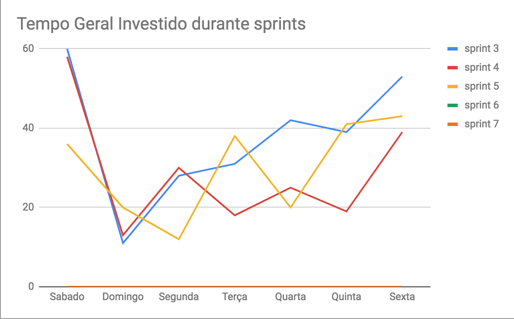
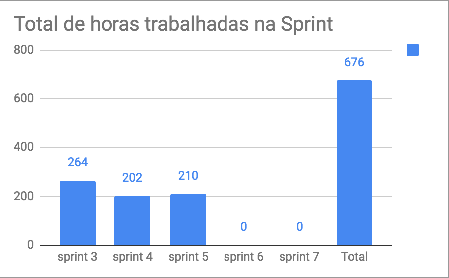
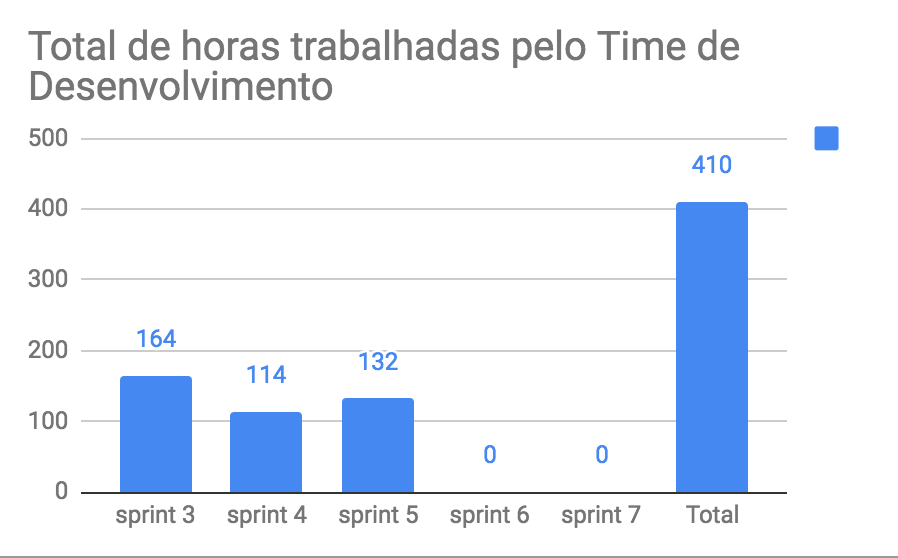
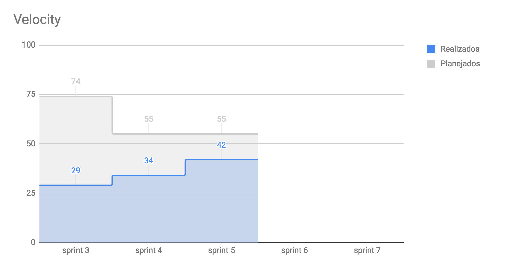

# Planejamento da Sprint
|Par|História|Pontos|
|---|:------:|:----:|
|[Dâmaso Pereira](https://github.com/orgs/fga-eps-mds/people/juniopereirab) e [Welison Almeida](https://github.com/orgs/fga-eps-mds/people/WelisonR)|US08|21|
|[Gustavo Lima](https://github.com/orgs/fga-eps-mds/people/gustavolima00) e [Shayane Alcântara](https://github.com/orgs/fga-eps-mds/people/shayanealcantara)|US02 e US11|16|
|[André Pinto](https://github.com/orgs/fga-eps-mds/people/andrelucax) e [Leonardo Medeiros](https://github.com/orgs/fga-eps-mds/people/leomedeiros1)|US10 e US06|18|

-------------------------------------------------------------------------------
# Retrospectiva da Sprint
## Pontos positivos
1. Equipe proativa;
2. Sinergia entre os membros da equipe;
3. No geral, maior familiaridade com as tecnologias;
4. Maior produtividade;
5. Histórias bem feitas pelo grupo de MDS;
6. Boa comunicação;
7. A integração entre os outros grupos do app melhorou;
8. EPS sempre disposto a tirar dúvidas;
9. Dailies presenciais mostrou ter melhorado a comunicação;
10. O documento de arquitetura tem se mostrado muito útil. Agora a equipe consegue desenvolver com mais clareza.

## Pontos de melhoria
1. Muitas pessoas estão colocando o tempo como dificuldade;
2. Falta de pontualidade na documentação da daily;
3. Dificuldade de entender os critérios de aceitação;
4. Demora da definição do documento de arquitetura;
5. Dificuldades com o pair programming;
6. Histórias não estão sendo desenvolvidas em ordem de importância aumentando o risco de criar dívida técnica das funcionalidades mais importantes.

## Medidas a serem tomadas
1. Organizar melhor o tempo;
2. Utilizar mensagens fixas no Telegram para fazer os avisos;
3. Detalhar melhor as tarefas das histórias;
4. Alinhar a produção de documentos com o desenvolvimento da equipe;
5. Definir canais no Discord para melhorar a comunicação entre os pares;
6. Instruir o time de desenvolvimento a produzir as histórias na ordem de prioridade do sprint backlog.

## Melhorias
1. A equipe não tem mais dificuldade de entender como o software deve ser estruturado;
2. O time de desenvolvimento consegue produzir com mais segurança com um diagrama para seguir;
3. A equipe está mais ciente das dificuldades dos membros.

-------------------------------------------------------------------------------
# Revisão da Sprint
* A [US08](https://github.com/fga-eps-mds/2018.2-iFood/issues/46) foi feita por completo.
* A [US02](https://github.com/fga-eps-mds/2018.2-iFood/issues/40) foi feita por completo.
* A [US11](https://github.com/fga-eps-mds/2018.2-iFood/issues/83) foi feita por completo.
* A [US10](https://github.com/fga-eps-mds/2018.2-iFood/issues/48) não preencheu todos os critérios de aceitação.
* A [US06](https://github.com/fga-eps-mds/2018.2-iFood/issues/44) foi feita por completo.
-------------------------------------------------------------------------------
# Métricas

## Horas totais

## Velocity

## Burndown
