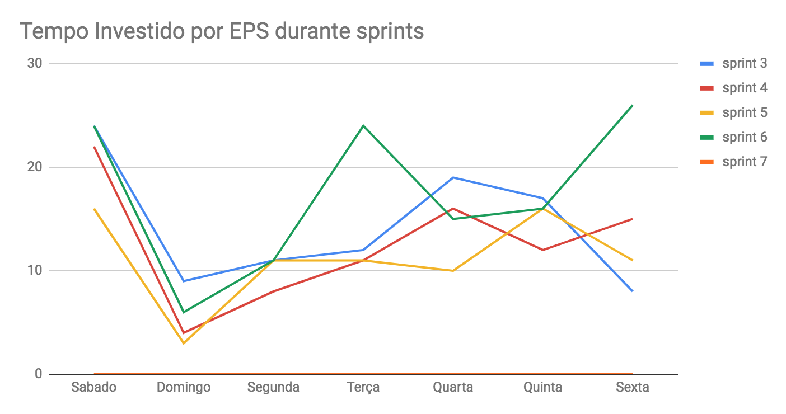
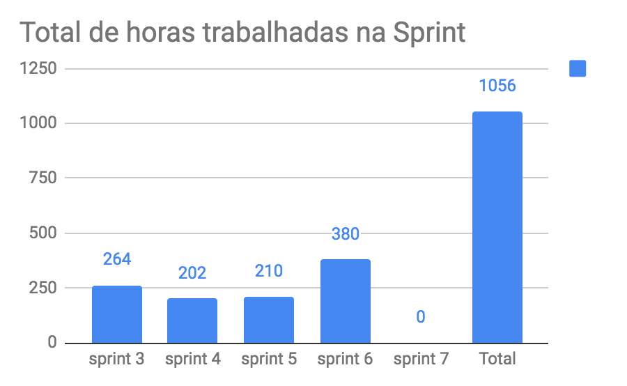
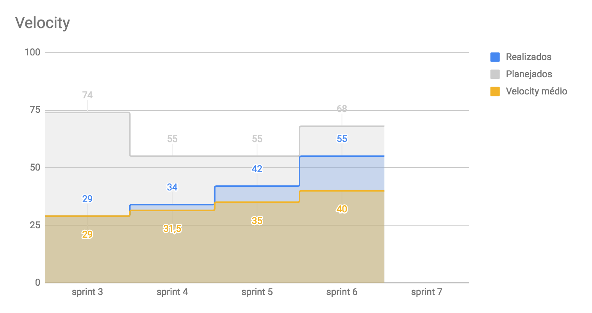

# Planejamento da Sprint

-------------------------------------------------------------------------------
# Riscos
## Riscos Internos
|Risco interno|Medidas|Pontuação|
|:------------|:------|:-------:|
| | | |
| | | |

## Riscos Externos
|Risco externo|Medidas|Pontuação|
|:------------|:------|:-------:|
| | | |
| | | |

-------------------------------------------------------------------------------
# Retrospectiva da Sprint
## Pontos positivos
1. 

## Pontos de melhoria
1. 

## Medidas a serem tomadas
1. 

## Melhorias
1. 

-------------------------------------------------------------------------------
# Revisão da Sprint
* 
-------------------------------------------------------------------------------
# Métricas
<!-- ## Horas durante a sprint

## Horas totais

## Velocity

## Burndown
 -->