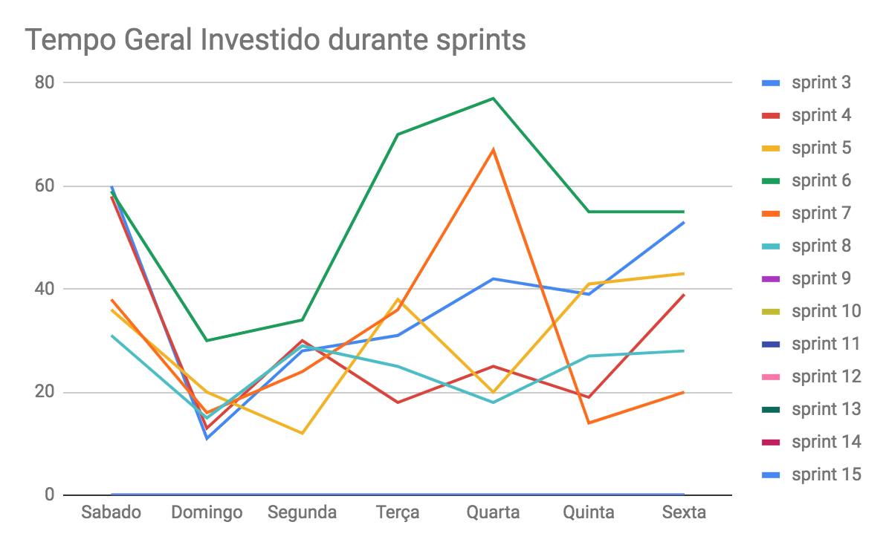
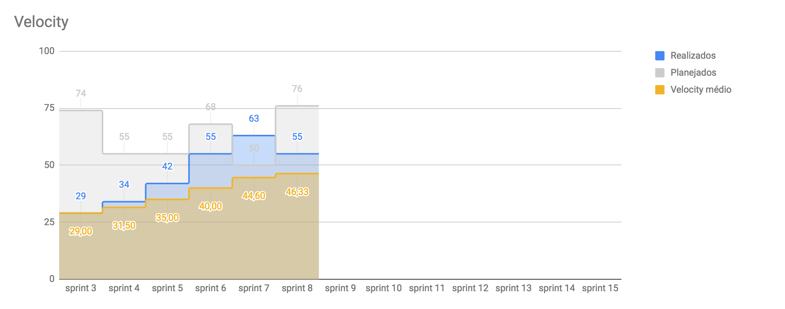
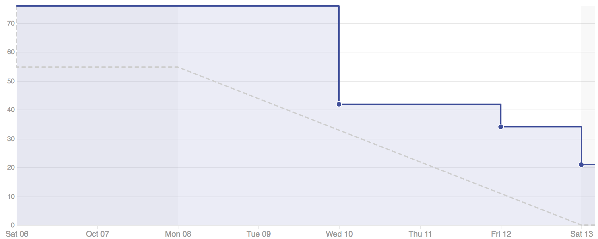

# Planejamento da Sprint
|Par|História|Pontos|
|---|:------:|:----:|
|[André Pinto](https://github.com/andrelucax) e [Gustavo Lima](https://github.com/gustavolima00)|US03|34|
|[Welison Almeida](https://github.com/WelisonR) e [Dâmaso Pereira](https://github.com/juniopereirab)|US12|21|
|[Shayane Alcântara](https://github.com/shayanealcantara) e [Leonardo Medeiros](https://github.com/leomedeiros1)|US16 e US05|8 + 13|

-------------------------------------------------------------------------------
# Retrospectiva da Sprint
## Pontos positivos
1. 

## Pontos de melhoria
1. 

## Medidas a serem tomadas
1. 

## Melhorias
1. 

-------------------------------------------------------------------------------
# Revisão da Sprint
* A [US03](https://github.com/fga-eps-mds/2018.2-Integra-Vendas/issues/41) foi feita por completo.
* A [US12](https://github.com/fga-eps-mds/2018.2-Integra-Vendas/issues/84) foram produzidas as funcionalidades no back-end mas não foi feito o front-end. A dupla responsável pela história não conseguiu fazer o pareamento durante a sprint.
* A [US16](https://github.com/fga-eps-mds/2018.2-Integra-Vendas/issues/85) foi feita por completo.
* A [US05](https://github.com/fga-eps-mds/2018.2-Integra-Vendas/issues/43) todos os critérios de aceitação foram feitos, mas faltaram os testes das funcionalidades.

-------------------------------------------------------------------------------
# Métricas
## Horas durante a sprint

## Horas totais

## Velocity

## Burndown

